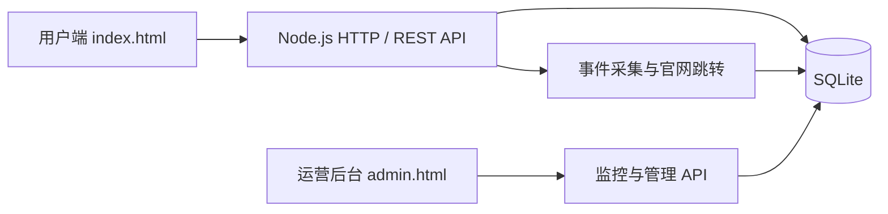

<p align="center">
  
</p>

<h1 align="center">泥壳AI工具站</h1>

<p align="center">
  面向中文用户的 AI 工具发现、筛选、比较与内容阅读平台。
  <br>
  内置用户端、SQLite API、投稿审核、行为分析和实时运营监控后台。
</p>

<p align="center">
  
  
  
  
</p>

## 项目简介

泥壳AI工具站是一个可以直接运行的全栈原型，不只是静态网址导航。项目围绕“发现工具 → 查看详情 → 访问官网”构建完整链路，并通过教程、资讯、专题、投稿和实时数据监控支持内容运营与商业化验证。

当前种子数据包含：

- 28 个 AI 工具（27 个普通工具、1 个推广工具）
- 16 个主分类（含为大目录预留的智能体、设计、学习、模型等分类）
- 12 篇教程与资讯内容
- 3 个工具专题
- 资讯来源名称与官方原始链接

内容资料更新日期：`2026-07-13`。

当前本地数据库已完成一批官方来源扩充：`130` 条工具记录，其中 `129` 条已发布（`128` 条普通工具 + `1` 条推广工具），另有 `101` 条官方来源追踪记录。

## 核心功能

### 用户端

- AI 工具分类、搜索、筛选和排序
- 网格与列表两种浏览方式
- 工具详情、功能介绍、价格和平台信息
- 工具收藏与多工具对比
- 教程、资讯、专题和相关推荐
- 工具官网安全跳转与点击统计
- 工具投稿、投稿状态查询和周报订阅
- 桌面端、平板端和手机端响应式布局

### 运营后台

- PV、UV、活跃 Session 和事件速率
- 搜索、工具卡片、详情页和官网跳转数据
- 用户发现到官网访问的转化漏斗
- 小时趋势、热门工具和热门搜索词
- 实时事件流、广告曝光与点击数据
- 投稿状态统计、联系方式查看和审核操作
- 服务健康、响应耗时、内存与数据库状态
- 5 秒自动刷新、暂停和统计时间窗口切换

### 后端与安全

- Node.js 内置 HTTP 服务与 SQLite 数据库
- 版本化数据库迁移和自动种子数据同步
- 授权 CSV、JSON、NDJSON 工具目录的幂等导入、来源追踪与重复合并
- REST API、统一错误响应和请求 ID
- 投稿幂等、输入校验和审核审计记录
- 埋点事件批量上报与事件 ID 去重
- IP 加盐哈希、敏感字段脱敏和数据留存控制
- 私网 URL、DNS Rebinding、请求体大小与频率限制
- CSP、禁止嵌套、权限策略等安全响应头

## 系统架构



项目不依赖前端框架、Web 框架或第三方 npm 包，页面与 API 由同一个 Node.js 进程提供。用户端当前通过 unpkg 加载 Lucide 图标脚本，生产部署时可改为固定版本并本地托管。

## 技术栈

| 层级 | 实现 |
|---|---|
| 用户端 | 原生 HTML、CSS、JavaScript |
| 运营后台 | 原生 HTML、CSS、JavaScript、Canvas 趋势图 |
| HTTP 与 API | Node.js `node:http` |
| 数据库 | Node.js `node:sqlite`、SQLite WAL |
| 测试 | Node.js 内置 Test Runner |
| 图标 | 品牌图标本地托管、Lucide CDN |

## 快速开始

### 环境要求

- Node.js `22.5.0` 或更高版本
- Git

### 克隆并启动

```powershell
git clone https://github.com/halivineyul050-lab/-AI-.git nike-ai-tools
Set-Location nike-ai-tools
Copy-Item .env.example .env
npm start
```

首次启动会自动创建 `data/nike-ai.db`、执行数据库迁移并导入种子数据。

启动后访问：

| 页面 | 本地地址 |
|---|---|
| 用户端 | <http://127.0.0.1:4173/> |
| 实时监控后台 | <http://127.0.0.1:4173/admin.html> |
| API 根路径 | <http://127.0.0.1:4173/api/v1> |
| 健康检查 | <http://127.0.0.1:4173/api/v1/health> |

开发监听模式：

```powershell
npm run dev
```

请使用 `npm start` 或 `npm run dev` 启动完整项目。单独使用静态文件服务器时，页面只能进入只读演示数据回退模式，无法使用数据库、投稿和监控功能。

## 环境变量

复制 `.env.example` 为 `.env` 后按需修改：

| 变量 | 作用 | 开发默认值 |
|---|---|---|
| `HOST` | 服务监听地址 | `127.0.0.1` |
| `PORT` | 服务端口 | `4173` |
| `NODE_ENV` | 运行环境 | `development` |
| `NIKE_DB_PATH` | SQLite 文件地址 | `./data/nike-ai.db` |
| `NIKE_ADMIN_TOKEN` | 后台 Bearer 管理令牌 | 空 |
| `NIKE_ANALYTICS_SALT` | 访客与 IP 哈希盐值 | 空 |
| `NIKE_ENABLE_TOKEN_ADMIN` | 生产环境是否允许共享令牌管理 | `false` |
| `NIKE_AUTO_SEED` | 是否同步种子内容 | `true` |
| `NIKE_ALLOWED_ORIGINS` | 允许的跨域来源 | 本机地址 |
| `NIKE_TRUST_PROXY` | 是否信任反向代理来源信息 | `false` |

`.env` 已被 Git 忽略，请勿提交真实令牌、分析盐值或其他密钥。

### 后台管理令牌

本机开发环境允许匿名查看脱敏、只读的聚合监控数据。热门搜索、最近事件、投稿联系方式和审核操作需要在后台输入 `NIKE_ADMIN_TOKEN`，请求使用：

```http
Authorization: Bearer <token>
```

令牌只保存在当前页面内存中，刷新或锁定页面后会被清除。生产环境必须配置稳定的数据库路径和高强度分析盐值；共享令牌管理默认关闭，建议使用账号体系、短会话、MFA、RBAC 和 CSRF 防护替代。

## 批量导入工具目录

项目支持从本地授权文件批量导入工具，不会联网抓取或绕过第三方网站的 robots.txt。模板位于 `imports/tool-catalog.template.csv`。

先进行事务演练，所有写入都会回滚：

```powershell
npm run catalog:import -- --input imports/my-authorized-tools.csv --provider authorized-export --dry-run
```

确认报告后导入审核队列：

```powershell
npm run catalog:import -- --input imports/my-authorized-tools.csv --provider authorized-export
```

仅经过人工核验的数据才建议添加 `--publish`。摘要和详情默认不会从外部文件导入；只有明确拥有相应使用权时才可添加 `--accept-editorial-text`。

本项目内置的官网独立核验批次可先演练再导入：

```powershell
npm run catalog:import:official -- --dry-run
npm run catalog:import:official
```

完整字段、去重规则和合规边界见 [AI工具批量导入与合规说明-2026-07-14.md](AI工具批量导入与合规说明-2026-07-14.md)。

## 常用 API

| 方法 | 地址 | 作用 |
|---|---|---|
| `GET` | `/api/v1/health` | 服务与数据库健康检查 |
| `GET` | `/api/v1/site/bootstrap` | 分类计数、内容、专题与推广位初始化数据 |
| `GET` | `/api/v1/tools` | 普通工具的搜索、筛选、排序和分页（默认24条） |
| `GET` | `/api/v1/tools/:slug` | 工具详情 |
| `GET` | `/api/v1/articles` | 教程与资讯列表 |
| `POST` | `/api/v1/tool-submissions` | 提交工具审核 |
| `GET` | `/api/v1/tool-submissions/:code/status` | 查询投稿审核状态 |
| `POST` | `/api/v1/newsletter/subscriptions` | 订阅周报 |
| `DELETE` | `/api/v1/newsletter/subscriptions/:token` | 退订周报 |
| `POST` | `/api/v1/events/batch` | 批量上报行为事件 |
| `GET` | `/r/tools/:slug` | 记录官网点击并跳转 |
| `GET` | `/api/admin/v1/monitoring?hours=24` | 获取实时监控快照 |

完整后端契约见 [backend/README.md](backend/README.md)，本地接口说明见 [泥壳AI工具站-后端地址与接口说明.md](泥壳AI工具站-后端地址与接口说明.md)。

## 测试

```powershell
npm test
```

当前共 `24` 项自动化测试，覆盖：

- 健康检查、静态品牌资源与内容初始化
- 工具组合筛选与详情读取
- 投稿校验、幂等和状态查询
- 订阅去重、事件去重和官网跳转
- URL 私网拦截与 DNS Rebinding 防护
- 监控聚合、时间窗口、事件脱敏和管理鉴权
- 目录导入迁移、演练回滚、来源幂等、官网去重和不安全 URL 拒绝
- 1,001 条合成授权目录的分页稳定性和 Bootstrap 体积上限

## 项目结构

```text
泥壳AI工具站/
├── index.html / styles.css / app.js       # 用户端
├── admin.html / admin.css / admin.js      # 实时监控与投稿审核后台
├── admin-icons.js                         # 后台自托管图标渲染器
├── brand-icon.svg                         # 品牌图标源文件裁切版
├── brand-icon-192.png                     # 页面与设备使用的轻量图标
├── server.mjs                             # HTTP、API、安全和静态文件服务
├── backend/
│   ├── database.mjs                       # 数据访问、迁移与内容同步
│   ├── tool-import.mjs                    # 授权目录规范化、去重与入库
│   ├── monitoring.mjs                     # 监控指标聚合
│   ├── validation.mjs                     # 请求与 URL 校验
│   ├── schema.sql                         # 数据库基础结构
│   ├── seed-data.json                     # 工具与内容种子数据
│   └── migrations/                        # 数据库迁移
├── tests/                                 # API、监控和安全测试
├── imports/                               # 本地授权目录导入模板
├── scripts/                               # 数据维护与目录导入命令
└── *.md                                   # 产品分析、接口与内容资料
```

## 生产部署建议

1. 使用稳定的 Node.js 22 LTS 运行环境和持久化磁盘。
2. 设置 `NODE_ENV=production`、稳定的 `NIKE_DB_PATH`、强随机管理令牌和分析盐值。
3. 通过 Nginx、Caddy 或云负载均衡提供 HTTPS 与反向代理。
4. 定期备份 SQLite 主数据库，并监控磁盘、WAL 和失效外链。
5. 根据访问量再引入 Redis、PostgreSQL、全文搜索和对象存储，无需在 MVP 阶段过度拆分服务。

`data/` 可能包含投稿邮箱、订阅记录、行为事件、审核日志和访问统计。该目录中的数据库、WAL 与日志已被 Git 忽略，但生产备份仍应按敏感数据管理，并设置访问控制、加密与保留期限。

## 当前边界

- 共享管理令牌是原型鉴权方案，不等同于生产级管理员账户体系。
- SQLite 适合当前单机 MVP；高并发、多实例部署需要迁移到服务端数据库。
- 周报已实现订阅和退订入库，尚未接入正式邮件发送服务。
- 用户端仍依赖 Google favicon、Unsplash 和 unpkg 等外部素材或脚本服务。
- 当前页面为同源静态渲染应用，不是完整的 SSR SEO 生产方案。
- 工具和资讯内容具有时效性，需要持续复核来源、状态和发布日期。

## 内容与素材说明

- 工具与资讯资料用于产品原型和信息整理，重要内容保留官方来源链接。
- 工具图标目前来自公开 favicon，文章封面使用 Unsplash 图片。
- 本项目并非各收录工具的官方网站，与相关品牌不存在隶属或背书关系；产品名称和商标归各自权利人所有。
- 正式商业上线前，应重新核验内容时效、图片授权、品牌规范和第三方链接。
- 本仓库未附带开源许可证；代码与内容的使用、分发权限以仓库所有者后续声明为准。
