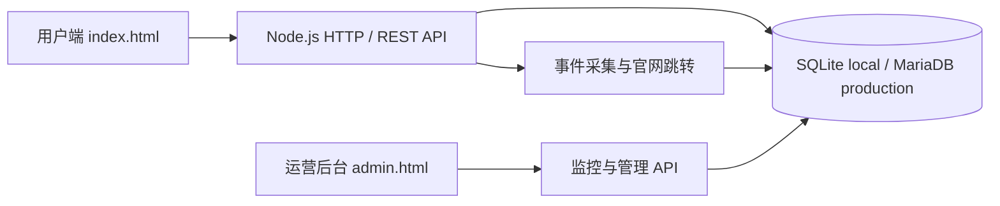

<p align="center">
  
</p>

<h1 align="center">泥壳AI工具站</h1>

<p align="center">
  面向中文用户的 AI 工具发现、筛选、比较与内容阅读平台。
  <br>
  内置工具发现、AI 生图、公告、内容运营、投稿审核与实时监控。
</p>

<p align="center">
  
  
  
</p>

## 项目简介

泥壳AI工具站是一个可以直接运行的全栈原型，不只是静态网址导航。项目围绕“发现工具 → 查看详情 → 访问官网”构建完整链路，并通过教程、资讯、专题、投稿和实时数据监控支持内容运营与商业化验证。

生产内容保存在 MariaDB；仓库里的种子文件和历史统计只代表各自生成时的本地快照，不作为线上实时数量。功能与运维现状以本 README、`backend/README.md` 和 `docs/production-release.md` 为准。

## 核心功能

### 站内小工具：视频转 GIF

小工具索引：`/utilities`，包含视频转 GIF、视频画面裁剪和视频马赛克与模糊。

从桌面或手机导航「小工具」进入 `/utilities/video-to-gif`。选择或拖入视频，设置起止时间、最长边尺寸、帧率和播放速度，生成后预览并下载循环 GIF；支持进度显示和取消重试。

- 文件在浏览器本地处理，不上传服务器；编码器和 Worker 均由本站提供。
- 输入上限 200MiB，每次截取最长 30 秒，尺寸最高 720px（最长边，不放大原视频）。默认前 5 秒、480px、10fps、原速。
- 输出最多 600 帧，累计处理最多 120M 像素，GIF 输出最多 80MiB。超过预算时提示缩小尺寸、降低帧率或缩短片段。
- 视频编码需浏览器支持，建议 MP4/H.264 或 WebM。GIF 不包含声音，最多 256 色；复杂渐变可能有色阶，转换速度取决于用户设备。
- 本地固定版本编码库：`assets/vendor/gifenc/`，gifenc 1.0.3（MIT），保留许可证及来源记录。无需安装新 npm 依赖。

### 站内小工具：视频画面裁剪

访问 `/utilities/video-crop`，支持拖动裁剪框、四角缩放、方向键移动/缩放，以及原比例、自由、1:1、16:9、9:16、4:3、3:4 预设。宽高和左/上边距可精确输入，预览按实际裁剪区域更新。MP4 输出按偶数像素对齐，锁定比例可能因像素对齐有微小偏差。

浏览器模块 Worker 使用本站固定版本 `@ffmpeg/core 0.12.10` 单线程 WASM，输出 H.264/AAC MP4，保留第一条音轨（若存在）和完整时长，不上传输入。导出会重新编码，音画质量和文件大小可能变化。支持进度、取消和重试；取消后销毁 Worker 释放编码内存。

当前输入限制：100MiB、120 秒、显示尺寸最长边 1920px。首次导出需要加载约 31MiB 运行资源，实际耗时取决于设备。解码格式受浏览器支持限制，建议 MP4/H.264 或 WebM。内置编码器许可证、来源和文件哈希见 `assets/vendor/ffmpeg/NOTICE.txt` 与 `LICENSE.txt`（GPL-2.0-or-later）。

### 站内小工具：分享链接提取（本机版）

访问 `/utilities/link-extract`，粘贴抖音或小红书的作品链接/分享文案，分别提取视频、视频音频、帖子文案和封面。音频导出 MP3；文案支持复制。优先读取同一视频的独立音轨，缺少独立音轨时从完整视频提取，不使用帖子的背景音乐地址。水印状态按来源标记显示，不去除画面中烧录的水印。小红书适配尚待真实分享链接验证。

此功能依赖本机 Chrome 远程调试和原生 FFmpeg（需在 PATH，或设置 `NIKE_FFMPEG_PATH`）。默认关闭，Windows 可显式启用：

```powershell
$env:NIKE_LINK_BROWSER_FILE="$env:LOCALAPPDATA/Google/Chrome/User Data/DevToolsActivePort"
npm start
```

需先在 Chrome 的 `chrome://inspect/#remote-debugging` 启用远程调试。也可设置 `NIKE_LINK_BROWSER_WS` 为本机浏览器的完整 WebSocket 地址；浏览器重启后地址可能变化，推荐连接文件配置。解析只创建并关闭自己的后台标签，沿用浏览器的访问状态，不读取或导出 Cookie。需要登录/验证的作品应先在浏览器中打开处理。

解析和媒体接口仅接受本机回环地址及本机 Host，拒绝跨站调用；本版本不能直接部署为公网解析服务。分享链接需访问平台，媒体经过本机服务转发，和纯浏览器视频编辑工具的处理方式不同。并发解析/音频转换各 1 个，解析每分钟 5 次，文件上限 1GiB，下载票据有效 20 分钟，音频任务超时 10 分钟。下载限制域名、固定公网 DNS 地址并逐跳验证，临时音频文件在完成、失败或取消后清理。

### 站内小工具：视频马赛克与模糊

站内视频遮挡工具位于 `/utilities/video-mask`：选择一个固定矩形区域，使用马赛克或模糊，调整 1–10 强度及开始/结束时间；支持拖动、四角缩放和精确像素设置。生效时间为左闭右开区间 `[开始, 结束)`。提供整幅画面实时预览，浏览器模糊预览与导出可能有细微区别。

复用本地 FFmpeg WASM 输出 H.264/AAC MP4，保留完整画面、时长和第一条音轨（如有），不上传文件。输入上限 100MiB、120 秒、最长边 1920px；奇数尺寸向下对齐到偶数（最多1px）。首版仅单个固定区域，不自动跟踪移动目标。取消终止 Worker，重试重新加载；不修改现有 GIF 与裁剪工具的数据。

### 用户端

- 顶部导航网站型布局 + 四段式首页（Hero 搜索 → 信任带 → 热门工具 → 最新收录）
- AI 工具分类、搜索、筛选和排序（筛选面板移动端折叠）
- AI 漫剧专属分类、分类内固定推荐顺序与工具 Logo 多级回退
- 网格与列表两种浏览方式
- 工具详情抽屉（含「快速判断」决策模块：适合场景 / 使用前注意 / 关键信息）
- 工具收藏与多工具对比
- 教程、资讯、专题和相关推荐
- AI 生图工作台：模型切换、参考图、画幅与生成历史页面
- 工具官网安全跳转与点击统计
- 工具投稿、投稿状态查询和周报订阅
- 桌面端、平板端和手机端响应式布局
- 暗色模式与 SEO 落地页（/tools/*、/guides/*、/compare/*）品牌统一

### 运营后台

- 工具、分类、资讯/教程和首页专题的新增、编辑、发布与归档
- 工具 Logo 本地上传、分类内排序、推荐和推广状态维护
- 数据修订号、冲突保护、操作审计和服务重启后的人工内容保留
- PV、UV、活跃 Session 和事件速率
- 搜索、工具卡片、详情页和官网跳转数据
- 用户发现到官网访问的转化漏斗
- 小时趋势、热门工具和热门搜索词
- 实时事件流、广告曝光与点击数据
- 投稿状态统计、联系方式查看和审核操作
- 上线公告管理；公告可在任意公开页面自动展示，每条公告在同一浏览器关闭后只弹一次
- 图片生成平台与模型管理，可配置兼容平台 API 地址、密钥、模型与可用状态
- 服务健康、响应耗时、内存与数据库状态
- 5 秒自动刷新、暂停和统计时间窗口切换

### 后端与安全

- Node.js 内置 HTTP 服务；本地开发默认 SQLite，生产使用 MariaDB
- 版本化数据库迁移和自动种子数据同步
- 授权 CSV、JSON、NDJSON 工具目录的幂等导入、来源追踪与重复合并
- REST API、统一错误响应和请求 ID
- 投稿幂等、输入校验和审核审计记录
- 埋点事件批量上报与事件 ID 去重
- IP 加盐哈希、敏感字段脱敏和数据留存控制
- 私网 URL、DNS Rebinding、请求体大小与频率限制
- CSP、禁止嵌套、权限策略等安全响应头

## 系统架构


```mermaid
flowchart LR
    U["用户端 index.html"] --> API["Node.js HTTP / REST API"]
    A["运营后台 admin.html"] --> ADMIN["监控与管理 API"]
    API --> DB[("SQLite local / MariaDB production")]
    ADMIN --> DB
    API --> EVENT["事件采集与官网跳转"]
    EVENT --> DB
```

项目不依赖前端框架或 Web 框架，页面与 API 由同一个 Node.js 进程提供。后端使用 `mysql2` 连接生产 MariaDB；项目还保留 SQLite 本地开发与测试后端。用户端通过 unpkg 加载 Lucide 图标脚本。

## 技术栈

| 层级 | 实现 |
|---|---|
| 用户端 | 原生 HTML、CSS、JavaScript |
| 运营后台 | 原生 HTML、CSS、JavaScript、Canvas 趋势图 |
| HTTP 与 API | Node.js `node:http` |
| 数据库 | 本地/测试：Node.js `node:sqlite`；生产：MariaDB 10.5、`mysql2` |
| 测试 | Node.js 内置 Test Runner |
| 图标 | 品牌图标本地托管、Lucide CDN |

## 快速开始

### 环境要求

- Node.js `22.5.0` 或更高版本
- Git

### 克隆并启动

```powershell
git clone https://github.com/halivineyul050-lab/-AI-.git nike-ai-tools
Set-Location nike-ai-tools
Copy-Item .env.example .env
npm start
```

首次启动会自动创建 `data/nike-ai.db`、执行数据库迁移并导入种子数据。

启动后访问：

| 页面 | 本地地址 |
|---|---|
| 用户端 | <http://127.0.0.1:4173/> |
| 实时监控后台 | <http://127.0.0.1:4173/admin.html> |
| API 根路径 | <http://127.0.0.1:4173/api/v1> |
| 健康检查 | <http://127.0.0.1:4173/api/v1/health> |

开发监听模式：

```powershell
npm run dev
```

请使用 `npm start` 或 `npm run dev` 启动完整项目。单独使用静态文件服务器时，页面只能进入只读演示数据回退模式，无法使用数据库、投稿和监控功能。

## 环境变量

复制 `.env.example` 为 `.env` 后按需修改：

| 变量 | 作用 | 开发默认值 |
|---|---|---|
| `HOST` | 服务监听地址 | `127.0.0.1` |
| `PORT` | 服务端口 | `4173` |
| `NODE_ENV` | 运行环境 | `development` |
| `NIKE_DB_PATH` | SQLite 文件地址 | `./data/nike-ai.db` |
| `NIKAI_DB_ENGINE` | 数据库后端：`sqlite` 或 `mariadb` | `sqlite` |
| `NIKAI_DB_NAME` / `NIKAI_DB_USER` / `NIKAI_DB_PASSWORD` | MariaDB 数据库连接 | 本地无需配置 |
| `NIKAI_DB_SOCKET` | MariaDB 本机 Unix socket | `/var/lib/mysql/mysql.sock` |
| `NIKE_ADMIN_TOKEN` | 后台 Bearer 管理令牌 | 空 |
| `NIKE_ANALYTICS_SALT` | 访客与 IP 哈希盐值 | 空 |
| `NIKE_IMAGE_CONFIG_KEY` | 图片平台 API Key 加密主密钥（32 字节转 64 位 hex） | 空 |
| `NIKE_ENABLE_TOKEN_ADMIN` | 生产环境是否允许共享令牌管理 | `false` |
| `NIKE_AUTO_SEED` | 是否同步种子内容 | `true` |
| `NIKE_ALLOWED_ORIGINS` | 允许的跨域来源 | 本机地址 |
| `NIKE_TRUST_PROXY` | 是否信任反向代理来源信息 | `false` |

`.env` 已被 Git 忽略，请勿提交真实令牌、分析盐值或其他密钥。

### 后台管理令牌

本机开发环境允许匿名查看脱敏、只读的聚合监控数据。内容管理、热门搜索、最近事件、投稿联系方式和审核操作需要在后台输入 `NIKE_ADMIN_TOKEN`，请求使用：

```http
Authorization: Bearer <token>
```

令牌只保存在当前页面内存中，刷新或锁定页面后会被清除。生产环境必须配置稳定的数据库路径和高强度分析盐值；共享令牌管理默认关闭，建议使用账号体系、短会话、MFA、RBAC 和 CSRF 防护替代。

后台保存的内容直接写入当前数据库后端，前端刷新即可读取。种子文件只负责首次安装和未被后台接管的内容；带有 `cms_managed_at` 标记的人工内容不会在服务重启时被覆盖。编辑请求携带 `revision`，当其他操作已经更新同一条内容时，接口返回 `409 revision_conflict`，避免静默覆盖。

## 批量导入工具目录

项目支持从本地授权文件批量导入工具，不会联网抓取或绕过第三方网站的 robots.txt。模板位于 `imports/tool-catalog.template.csv`。

先进行事务演练，所有写入都会回滚：

```powershell
npm run catalog:import -- --input imports/my-authorized-tools.csv --provider authorized-export --dry-run
```

确认报告后导入审核队列：

```powershell
npm run catalog:import -- --input imports/my-authorized-tools.csv --provider authorized-export
```

仅经过人工核验的数据才建议添加 `--publish`。摘要和详情默认不会从外部文件导入；只有明确拥有相应使用权时才可添加 `--accept-editorial-text`。

本项目内置的官网独立核验批次可先演练再导入：

```powershell
npm run catalog:import:official -- --dry-run
npm run catalog:import:official
```

同步和验证全站 Logo：

```powershell
npm run logos:sync
npm run logos:verify
```

完整字段、去重规则和合规边界见 [AI工具批量导入与合规说明-2026-07-14.md](AI工具批量导入与合规说明-2026-07-14.md)。

## 常用 API

| 方法 | 地址 | 作用 |
|---|---|---|
| `GET` | `/api/v1/health` | 服务与数据库健康检查 |
| `GET` | `/api/v1/site/bootstrap` | 分类计数、内容、专题与推广位初始化数据 |
| `GET` | `/api/v1/tools` | 普通工具的搜索、筛选、排序和分页（默认24条） |
| `GET` | `/api/v1/tools/:slug` | 工具详情 |
| `GET` | `/api/v1/articles` | 教程与资讯列表 |
| `GET` | `/api/v1/site-announcements` | 当前应显示的上线公告 |
| `GET` | `/api/v1/image-models` | 对用户开放的图片模型 |
| `GET` | `/api/v1/content/version` | 获取前端内容修订号 |
| `POST` | `/api/v1/tool-submissions` | 提交工具审核 |
| `GET` | `/api/v1/tool-submissions/:code/status` | 查询投稿审核状态 |
| `POST` | `/api/v1/newsletter/subscriptions` | 订阅周报 |
| `POST` | `/api/v1/feedback` | 提交内容纠错、功能问题和建议 |
| `POST` | `/api/v1/auth/register` | 注册普通用户账号 |
| `POST` | `/api/v1/auth/login` | 登录并创建会话 |
| `GET` | `/api/v1/auth/me` | 获取当前登录用户 |
| `POST` | `/api/v1/auth/logout` | 退出当前会话 |
| `GET` | `/api/v1/account/favorites` | 获取当前用户的收藏工具 |
| `PUT/DELETE` | `/api/v1/account/favorites/:toolId` | 添加或移除收藏工具 |
| `DELETE` | `/api/v1/newsletter/subscriptions/:token` | 退订周报 |
| `POST` | `/api/v1/events/batch` | 批量上报行为事件 |
| `GET` | `/r/tools/:slug` | 记录官网点击并跳转 |
| `GET` | `/api/admin/v1/monitoring?hours=24` | 获取实时监控快照 |
| `GET/POST` | `/api/admin/v1/content/:type` | 查询或新增工具、分类、文章和专题 |
| `GET/PATCH/DELETE` | `/api/admin/v1/content/:type/:id` | 查看、更新或归档单条内容 |
| `POST` | `/api/admin/v1/content/media/logos` | 校验并上传本地工具 Logo |
| `GET/POST/PATCH/DELETE` | `/api/admin/v1/site-announcements` | 管理上线公告 |
| `GET/POST/PATCH/DELETE` | `/api/admin/v1/image-providers`、`/api/admin/v1/image-models` | 管理图片平台和模型 |

### AI 资讯自动发布

AI 资讯支持按计划自动收集和发布。服务会读取配置的官方 RSS 来源，使用 OpenAI 生成中文标题、摘要和正文，并直接写入已发布内容。默认关闭；部署时在环境变量中设置 `OPENAI_API_KEY` 和 `NIKE_AUTO_NEWS=true` 才会启用。

可选配置：`NIKE_NEWS_INTERVAL_MINUTES`（默认 360 分钟）、`NIKE_NEWS_AI_MODEL`（默认 `gpt-5.5`）、`NIKE_NEWS_BASE_URL`（默认 `https://lucen.cc`）、`NIKE_NEWS_REASONING_EFFORT`（默认 `xhigh`）、`NIKE_NEWS_DISABLE_RESPONSE_STORAGE`（默认 `true`）和 `NIKE_NEWS_FEEDS`（逗号分隔的 RSS 地址）。没有 API 密钥或开关未开启时，网站正常运行但不会执行采集任务。

完整后端契约见 [backend/README.md](backend/README.md)，本地接口说明见 [泥壳AI工具站-后端地址与接口说明.md](泥壳AI工具站-后端地址与接口说明.md)。

## 测试

```powershell
npm test
```

每次提交前和正式发布时运行完整自动化测试；测试数量随功能变化，不在 README 固定计数。覆盖范围包括：

- 健康检查、静态品牌资源与内容初始化
- 工具组合筛选与详情读取
- 投稿校验、幂等和状态查询
- 订阅去重、事件去重和官网跳转
- URL 私网拦截与 DNS Rebinding 防护
- 监控聚合、时间窗口、事件脱敏和管理鉴权
- 目录导入迁移、演练回滚、来源幂等、官网去重和不安全 URL 拒绝
- 1,001 条合成授权目录的分页稳定性和 Bootstrap 体积上限
- 138 个 Logo 资产、哈希、MIME、静态路由和目录穿越防护
- CMS 增删改查、发布可见性、修订冲突、审计记录和重启持久化
- Logo 上传签名校验、危险 SVG 拒绝和本地静态资源服务
- 问题反馈的同意校验、字段校验和待处理入库
- 用户注册、密码哈希、登录会话、当前用户和退出登录
- AI 资讯 RSS 解析及未配置密钥时的停用保护

## 项目结构

```text
泥壳AI工具站/
├── index.html / styles.css / app.js       # 用户端
├── admin.html / admin.css / admin.js      # 实时监控、内容管理与投稿审核后台
├── admin-icons.js                         # 后台自托管图标渲染器
├── brand-icon.svg                         # 品牌图标源文件裁切版
├── brand-icon-192.png                     # 页面与设备使用的轻量图标
├── server.mjs                             # HTTP、API、安全和静态文件服务
├── assets/tool-logos/                     # 本地托管的工具 Logo 资产
├── backend/
│   ├── database.mjs                       # 数据访问、迁移与内容同步
│   ├── mariadb/                           # MariaDB 数据访问适配
│   ├── image-generation-gateway.mjs       # 上游生图代理和结果校验
│   ├── site-announcements.mjs             # 上线公告接口
│   ├── content-admin.mjs                  # CMS 校验、事务、审计与媒体上传
│   ├── tool-import.mjs                    # 授权目录规范化、去重与入库
│   ├── monitoring.mjs                     # 监控指标聚合
│   ├── validation.mjs                     # 请求与 URL 校验
│   ├── schema.sql                         # 数据库基础结构
│   ├── seed-data.json                     # 工具与内容种子数据
│   └── migrations/                        # 数据库迁移
├── tests/                                 # API、监控和安全测试
├── imports/                               # 本地授权目录导入模板
├── scripts/                               # 数据维护、目录导入与 Logo 同步命令
└── *.md                                   # 产品分析、接口与内容资料
```

## 生产部署建议

1. 生产当前为单机 Node.js + MariaDB 10.5 + Nginx；MariaDB 仅绑定本机 socket/回环地址。凭据只存服务器受限权限的环境文件，不进仓库。
2. 发布通过 GitHub Actions `main` 流水线或受控 SSH 调用 `/opt/nikai-ai/scripts/release-production.sh`；发布前先按已配置数据库后端备份，再生成代码快照、跑测试、重启和健康检查。完整步骤见 [生产发布流程](docs/production-release.md)。
3. 管理后台有账号会话和管理令牌两层入口；用户账号与高权限账号由后台配置。不要把任何凭据保存到浏览器可读存储或提交到仓库。
4. 定期验证 MariaDB 备份恢复、磁盘空间、服务健康和线上页面；回滚代码不等同于回滚数据库数据。

`data/` 可能包含投稿邮箱、订阅记录、行为事件、审核日志和访问统计。该目录中的数据库、WAL 与日志已被 Git 忽略，但生产备份仍应按敏感数据管理，并设置访问控制、加密与保留期限。

## 当前边界

- 主站已于 2026-07 下线「登录 / 注册」入口；账号与评分相关后端 API 仍保留（供后续账号体系复用），auth.html 仍可访问但主站不再链接。
- 共享管理令牌是原型鉴权方案，不等同于生产级管理员账户体系。
- 当前生产部署为单机架构；扩展到多实例前需复核会话、文件资源和任务队列的共享方式。
- 周报已实现订阅和退订入库，尚未接入正式邮件发送服务。
- 用户端仍依赖 Unsplash 和 unpkg 等外部素材或脚本服务（工具 Logo 已全部本地托管，不再依赖 Google favicon）。
- 当前页面为同源静态渲染应用，不是完整的 SSR SEO 生产方案。
- 工具和资讯内容具有时效性，需要持续复核来源、状态和发布日期。

## 内容与素材说明

- 工具与资讯资料用于产品原型和信息整理，重要内容保留官方来源链接。
- 工具图标目前来自公开 favicon，文章封面使用 Unsplash 图片。
- 本项目并非各收录工具的官方网站，与相关品牌不存在隶属或背书关系；产品名称和商标归各自权利人所有。
- 正式商业上线前，应重新核验内容时效、图片授权、品牌规范和第三方链接。
- 本仓库未附带开源许可证；代码与内容的使用、分发权限以仓库所有者后续声明为准。


## 图片处理套件（2026-09-09）

- `/utilities/image-edit`：本地裁剪、旋转、尺寸调整和 PNG/JPEG/WebP 压缩转换，工作图最长边 4096px。
- `/utilities/image-background`：U2NetP 去背景，透明 PNG、白底、黑底、自选底色，模型输入最长边 2048px。
- `/utilities/image-enhance`：SubPixel CNN 3 倍放大及可恢复的清晰度微调。模型输入最长边 512px；大图会先缩小，页面显示输入、输出尺寸。

三种工具均支持 PNG/JPEG/WebP/BMP 输入，最大 20MiB、16Mi 像素，文件头先于解码验证。基础编辑不上传图片；另外两种工具使用本站 CPU 服务，任务结束清理临时图片。服务器两种新模型共用一个处理槽、60 秒超时，不需要用户 API Key。

Python 3.11 环境安装 `scripts/image-tools-requirements.txt`，按 `assets/vendor/image-tools/NOTICE.md` 下载并核对两个模型；配置 `.env.example` 的三个 `NIKE_IMAGE_*` 路径后重启服务。状态接口为 `/api/utilities/image-tools/status`。部署验证与公网限制见 `docs/deployment-image-suite-20260909.md`。
